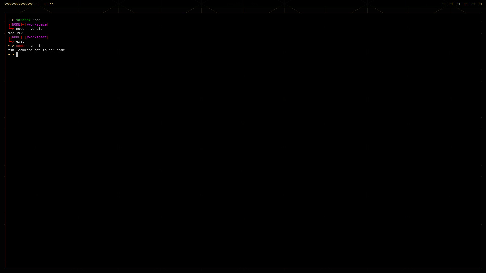

# sandbox



## Basic setup

1. Create your own images, or copy over the examples: `cp -r examples images`
2. Build the images: `./build-images.sh`
3. Get a sandbox shell: `./sandbox.sh node`

## Setting it up as a global shell command on NixOS

Clone this repo into your nixos config, then add it to your config:

```
let
  sandbox = pkgs.callPackage ./sandbox { };
in
{
    environment.systemPackages = [
        sandbox
    ];
}
```

Rebuild, and you can call `sandbox [environment]` in any directory to get a sandbox shell in there.

## How it works

We're just building docker images. We then create temporary containers, mount the current working directory to /workspace, and then drop into a shell.

The images are tagged with `sandbox-[environment]`. If you want to use `sandbox XYZ` to create a specific environment, just name the image `sandbox-XYZ`.

You don't want to build an image first, and use a Dockerfile directly, similar to how shell.nix files work? If you have a Dockerfile in your current working directory and omit the environment (i.e. just call `sandbox`), it'll build and then use that Dockerfile for your sandbox.

Otherwise:

```
➤ sandbox --help
Usage: sandbox [suffix] [OPTIONS]
Options:
  -n, --network NETWORK    Container network to use
  -p, --ports PORTS        Comma-separated list of ports (e.g., 8080,3000,5432)
  -w, --workspace DIR      Container workspace directory (default: /workspace)
  --name NAME              Container name
  --cmd COMMAND            Command to run
  --docker                 Use docker instead of podman
  -h, --help              Show this help message

Example: sandbox node --network sandbox --name frontend --ports 8080,3000
```

## Podman vs Docker

I'm nowadays using Podman per default because GPU passthrough actually works with it (and it doesn't really with rootless Docker), so that's the default runtime here. I've hardcoded in that the podman runtime gets all nvidia GPUs passed in per default, for my convenience, feel free to adjust it for yourself.

You can switch to docker though using the `--docker` option, if you need to. Useful if you for example need a shell in some docker compose project, while also needing to hook into that network (which you can using `--network`).
